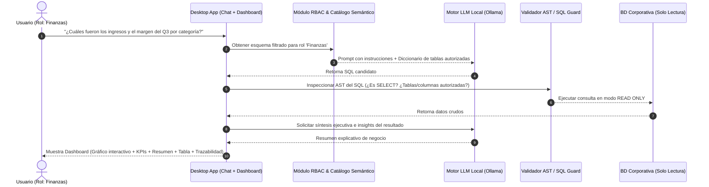
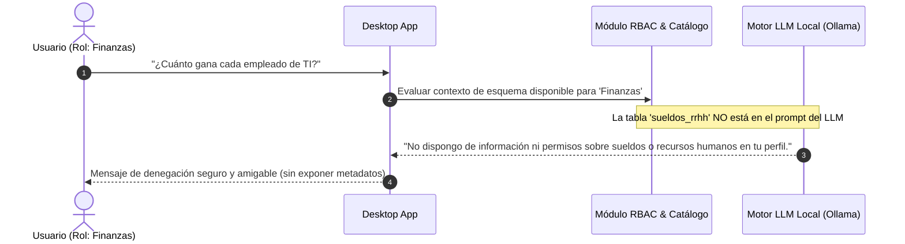

# Proyecto: Democratización de Datos Corporativos con IA Local

> **Documento:** 01 - Visión, Alcance y Requisitos Base  
> **Estado:** Consensuado y Aprobado tras Alineación Técnica  
> **Área:** Arquitectura, Gobernanza de Datos y Seguridad  

---

## 1. Resumen Ejecutivo y Visión

El presente proyecto tiene como objetivo **democratizar el acceso y la explotación de los datos corporativos**, eliminando las barreras técnicas que impiden a usuarios no especializados interactuar directamente con la información de las bases de datos de la empresa.

La meta fundamental es permitir que **cualquier colaborador (sin conocimientos técnicos de SQL, programación o análisis avanzado) pueda realizar preguntas en lenguaje natural a un asistente de Inteligencia Artificial y recibir al instante:**
1. **Dashboards y visualizaciones interactivas** adaptadas automáticamente a la naturaleza de la pregunta y de los datos.
2. **Resumen ejecutivo e insights clave** redactados por la IA en lenguaje claro de negocio.
3. **Tabla interactiva de datos subyacentes** con paginación, ordenamiento y búsqueda.
4. **Panel desplegable de trazabilidad y auditoría** con la explicación del cálculo, diccionario del dato y la consulta SQL ejecutada de fondo.

Todo el ecosistema opera bajo una premisa inquebrantable de **soberanía de datos, privacidad absoluta y costo operativo cero en licencias de IA en la nube**, ejecutándose en formato de **Aplicación de Escritorio Standalone 100% desconectada (offline)**.

---

## 2. Problema de Negocio que Resuelve

En el entorno corporativo tradicional se presentan los siguientes cuellos de botella:
- **Dependencia de analistas y TI:** Los usuarios de negocio dependen de los equipos técnicos para generar reportes y consultas a bases de datos, con tiempos de espera de días o semanas.
- **Silos de información inaccesibles:** Los datos residen en bases de datos relacionales empresariales (PostgreSQL, SQL Server, MySQL, SQLite) inaccesibles para el usuario promedio.
- **Falta de contexto analítico:** Un reporte crudo en hoja de cálculo muchas veces carece de interpretaciones comprensibles y visualizaciones directas.
- **Riesgo de fuga de información confidencial:** El uso indebido de herramientas de IA en la nube públicas (ChatGPT, Claude, etc.) expone secretos comerciales, datos financieros y datos personales sensibles fuera de la red de la empresa.

---

## 3. Pilares y Principios No Negociables del Sistema

```
┌────────────────────────────────────────────────────────────────────────┐
│                        PILARES DEL SISTEMA                             │
├────────────────────┬────────────────────┬──────────────────────────────┤
│ 1. 100% OFFLINE /  │ 2. MOTOR LLM LOCAL │ 3. GOBERNANZA Y CONTROL      │
│    DESKTOP APP     │    AGNÓSTICO       │    DE ACCESO ESTRICTO (RBAC) │
│                    │                    │                              │
│ Cero conexión a    │ Conexión local a   │ Permisos a nivel de dominio, │
│ internet. Datos    │ Ollama / OpenAI-API│ tabla y enmascaramiento de   │
│ jamás salen del    │ compatible. Sin    │ columnas sensibles. La IA    │
│ equipo/servidor.   │ costos de API.     │ solo ve lo autorizado.       │
└────────────────────┴────────────────────┴──────────────────────────────┘
```

### 3.1. Soberanía y Privacidad 100% Offline (Local Standalone)
- **Aislamiento absoluto:** La aplicación no requiere conexión a internet y opera en modo local cerrado.
- **Cero telemetría externa:** Ninguna consulta, esquema de base de datos ni resultado viaja a servidores de terceros.

### 3.2. Motor LLM Local y Conector Agnóstico
- La aplicación se comunica localmente mediante API estándar (compatible con **Ollama**, **llama.cpp server**, **LM Studio**, **vLLM**).
- Permite alternar con facilidad entre modelos abiertos de vanguardia (ej. *Qwen 2.5 Coder/Instruct*, *Llama 3.1 / 3.3*, *Mistral*, *DeepSeek*).
- Arquitectura modular adaptable tanto a hardware con GPU dedicada (NVIDIA RTX/A-series) como a entornos basados exclusivamente en CPU con cuantización eficiente (GGUF 4-bit / 8-bit).

### 3.3. Gobernanza de Datos y Sistema de Permisos Riguroso (RBAC)
- **Gestión interna/local de identidades:** Panel de administración integrado para crear usuarios, asignar contraseñas cifradas y definir roles.
- **Granularidad completa de permisos:**
  - **Dominio / Módulo temático:** (ej. Finanzas/Economía, RRHH, Operaciones, Ventas).
  - **Tablas específicas:** Habilitación explícita de acceso por tabla.
  - **Columnas sensibles:** Enmascaramiento o exclusión total de columnas confidenciales (ej. DNI, salarios, datos bancarios).
- **Inyección de Esquema Dinámico Filtrado:** El LLM **únicamente recibe en su contexto las tablas y columnas autorizadas para el usuario en sesión**, impidiendo alucinaciones o filtraciones involuntarias.
- **Validador AST / Parser SQL de Seguridad:** Toda consulta generada por la IA pasa por un analizador sintáctico en el backend antes de su ejecución, validando que sea estrictamente `SELECT` (Solo Lectura) y que no involucre tablas o columnas no autorizadas.

### 3.4. Catálogo Semántico de Datos Administrable
- Asistente interactivo en el panel de administración que inspecciona la base de datos y permite al administrador enriquecer el esquema con descripciones en lenguaje natural, sinónimos corporativos y fórmulas de negocio.

---

## 4. Flujo de Usuario Esperado (User Journey)

### Escenario 1: Consulta Autorizada (Ej. Usuario de Finanzas/Economía)


### Escenario 2: Intento de Consulta No Autorizada (Ej. Pregunta fuera de dominio)


---

## 5. Fuentes de Datos Soportadas

El sistema se conecta a las bases de datos relacionales corporativas más utilizadas mediante drivers nativos universales:
- **PostgreSQL** (`psycopg` binary)
- **SQLite 3** (nativo embebido)
- **MySQL / MariaDB** (`pymysql`)
- **Microsoft SQL Server (MSSQL)** (`pymssql` / `pyodbc`)

*(Nota: Oracle Database fue excluida deliberadamente por razones de portabilidad y dependencias nativas complejas; consultar ADR-001 en Documento 06).*

---

## 6. Componentes del Entregable Analítico por Consulta

Cada respuesta generada para el usuario en la interfaz contiene 4 bloques clave:
1. **Gráficos Interactivos:** Visualizaciones dinámicas (barras, líneas de tendencia, torta/dona, métricas KPI destacadas).
2. **Resumen Ejecutivo / Insights:** Interpretación en texto claro sobre qué representan los números y hallazgos relevantes.
3. **Tabla Interactiva de Datos:** Visualización tabular paginada, ordenable por columnas y con buscador integrado.
4. **Panel Desplegable de Trazabilidad:** Documentación del origen del dato, descripción de los campos involucrados y la sentencia SQL ejecutada para máxima transparencia y auditoría.

---

## 7. Criterios de Éxito del Proyecto

| Criterio | Meta Requerida |
| :--- | :--- |
| **Soberanía y Privacidad** | 100% Offline. Cero paquetes salientes a internet. |
| **Seguridad de Acceso (RBAC)** | 100% de consultas bloqueadas si involucran tablas/columnas fuera del rol. |
| **Seguridad de BD** | Cero riesgo de modificación de datos (estricto `READ ONLY` + validación AST). |
| **Facilidad de Uso** | Usuarios sin conocimientos técnicos obtienen respuestas visuales y explicadas en segundos. |
| **Costos Operativos** | Cero costo en licencias o APIs de pago por token de IA. |
