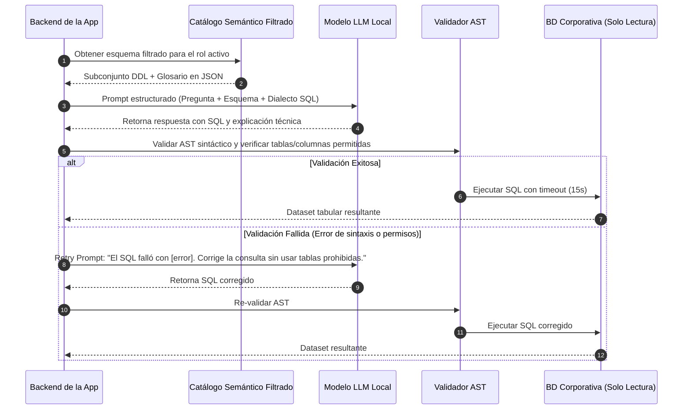

# Documento 04: Motor de IA Local y Pipeline Text-to-SQL

> **Documento:** 04 - Pipeline de Inferencia Local y Orquestación de IA  
> **Estado:** Especificación Técnica Aprobada  
> **Área:** Inteligencia Artificial Aplicada y Procesamiento de Lenguaje Natural  

---

## 1. Estrategia de Inferencia Local

El sistema utiliza un **Conector de Inferencia Agnóstico** que interactúa mediante protocolo HTTP estándar en `localhost` con motores de inferencia locales optimizados:

- **Ollama** (Recomendado por su facilidad de despliegue y gestión de modelos GGUF).
- **llama.cpp server** (Para máxima optimización en entornos con solo CPU o VRAM limitada).
- **vLLM / LM Studio / LocalAI** (Cualquier endpoint compatible con la API estándar de OpenAI).

```
┌─────────────────────────────────────────────────────────────────────────────┐
│                       DESKTOP APPLICATION BACKEND                           │
│                                                                             │
│  ┌───────────────────────────────────────────────────────────────────────┐  │
│  │                     ADAPTADOR DE INFERENCIA LOCAL                     │  │
│  │ - Cliente HTTP Asíncrono                                              │  │
│  │ - Streaming de respuestas                                             │  │
│  │ - Control de temperatura (0.0 para SQL, 0.3 para Resumen)             │  │
│  └──────────────────────────────────┬────────────────────────────────────┘  │
└─────────────────────────────────────┼───────────────────────────────────────┘
                                      │ HTTP Local (localhost:11434)
                                      ▼
┌─────────────────────────────────────────────────────────────────────────────┐
│                    MOTOR DE INFERENCIA LOCAL (OLLAMA / LLAMA.CPP)           │
│                                                                             │
│   Modelos Cuantizados GGUF:                                                 │
│   • Qwen 2.5 Coder (7B / 14B / 32B) -> Especialista en Text-to-SQL          │
│   • Llama 3.1 / 3.3 (8B / 70B)      -> Especialista en Síntesis de Negocio  │
│   • DeepSeek Coder V2 (16B / 33B)   -> Consultas complejas multivariable    │
└─────────────────────────────────────────────────────────────────────────────┘
```

---

## 2. Catálogo Semántico de Datos (Diccionario Corporativo)

Para que el modelo traduzca preguntas humanas a SQL con precisión milimétrica sin alucinar, el sistema mantiene un **Catálogo Semántico** administrable desde la interfaz de la aplicación.

### Estructura de Definición Semántica
Cada tabla y columna en el catálogo contiene:
```json
{
  "dominio": "Finanzas",
  "tabla_fisica": "fact_ingresos_mensuales",
  "descripcion_negocio": "Registra los ingresos brutos, netos e impuestos cobrados mensualmente por sucursal.",
  "sinonimos": ["ventas", "facturacion", "cobros", "recaudacion"],
  "columnas": [
    {
      "nombre_fisico": "id_sucursal",
      "tipo_dato": "INTEGER",
      "descripcion": "Identificador de la tienda o sucursal.",
      "es_clave_foranea": "dim_sucursal.id_sucursal"
    },
    {
      "nombre_fisico": "monto_neto",
      "tipo_dato": "DECIMAL(14,2)",
      "descripcion": "Monto neto en moneda local antes de IVA.",
      "unidad": "CLP / USD"
    },
    {
      "nombre_fisico": "fecha_cierre",
      "tipo_dato": "DATE",
      "descripcion": "Fecha de contabilización del ingreso (formato YYYY-MM-DD)."
    }
  ],
  "reglas_negocio": [
    "Para calcular el total facturado anual, sumar 'monto_neto' agrupado por año de 'fecha_cierre'.",
    "Ignorar registros con estado = 'ANULADO'."
  ]
}
```

---

## 3. Pipeline de Generación Text-to-SQL

El pipeline de traducción y ejecución sigue un ciclo de 4 etapas:



---

## 4. Estructura de Prompts Especializados

### 4.1. Prompt 1: Generación Text-to-SQL (Temperatura: 0.0)
```text
[SYSTEM]
Eres un experto analista de datos SQL especializado en el motor {DIALECTO_BD} (ej. PostgreSQL).
Tu tarea es convertir la pregunta del usuario en una consulta SQL válida y de solo lectura.

REGLAS ESTRICTAS:
1. Usa ÚNICAMENTE las tablas y columnas listadas a continuación en el ESQUEMA AUTORIZADO.
2. NO uses subconsultas destructivas ni comandos que no sean SELECT.
3. Respeta siempre las reglas de negocio del catálogo semántico.
4. Genera siempre un alias legible para las métricas agregadas (ej: AS total_ventas).

ESQUEMA AUTORIZADO:
{ESQUEMA_JSON_FILTRADO_POR_ROL}

[USER]
Pregunta: {PREGUNTA_USUARIO}

Responde en formato JSON estructurado:
{
  "sql": "SELECT ...",
  "explicacion_logica": "Breve justificación de las tablas y agregaciones utilizadas",
  "campos_utilizados": ["tabla.columna1", "tabla.columna2"]
}
```

### 4.2. Prompt 2: Text-to-Viz e Insights Ejecutivos (Temperatura: 0.3)
```text
[SYSTEM]
Eres un consultor de inteligencia de negocios.
A partir de la pregunta del usuario y los datos obtenidos de la consulta, debes determinar la mejor visualización interactiva y redactar una síntesis clara en lenguaje de negocio.

[USER]
Pregunta original: {PREGUNTA_USUARIO}
Datos devueltos (muestra): {DATOS_JSON}

Responde en formato JSON estructurado:
{
  "tipo_grafico": "bar" | "line" | "pie" | "kpi_card" | "table",
  "configuracion_grafico": {
    "eje_x": "nombre_columna_x",
    "eje_y": "nombre_columna_y",
    "etiqueta_serie": "Ventas Mensuales",
    "formato_valor": "$#,##0"
  },
  "kpis": [
    {"titulo": "Total General", "valor": "$125.400.000"},
    {"titulo": "Variación vs Mes Anterior", "valor": "+14.2%"}
  ],
  "resumen_ejecutivo": "Explicación en 2-3 párrafos claros sin tecnicismos de base de datos.",
  "insights_clave": [
    "Insight 1: La categoría de mayor crecimiento fue...",
    "Insight 2: Se detectó una caída en la sucursal..."
  ]
}
```

---

## 5. Matriz de Selección de Modelos Open Source

| Modelo Local | Parámetros | RAM / VRAM Requerida | Especialidad / Rol en el Sistema |
| :--- | :--- | :--- | :--- |
| **Qwen 2.5 Coder 7B (Q4/Q8)** | 7 Mil Millones | 6 GB RAM / 5 GB VRAM | **Recomendado para equipos estándar / CPU.** Excelente precisión en SQL con bajo consumo. |
| **Qwen 2.5 Coder 14B (Q4/Q8)** | 14 Mil Millones | 10 GB RAM / 9 GB VRAM | **Óptimo para estaciones con GPU dedicada.** SQL avanzado, joins múltiples y alta velocidad. |
| **Llama 3.1 8B Instruct (Q4/Q8)** | 8 Mil Millones | 6 GB RAM / 5 GB VRAM | **Excelente en redacción de resúmenes ejecutivos e insights en español.** |
| **DeepSeek Coder V2 Lite (16B)** | 16 Mil Millones (MoE) | 12 GB RAM / 10 GB VRAM | Muy potente en consultas complejas con agrupaciones y ventanas estadísticas. |

---

## 6. Autocorrección y Resiliencia

Si la base de datos devuelve un error de sintaxis o tipo de datos (ej. `column "fecha" does not exist; did you mean "fecha_cierre"?`):
1. El backend captura el mensaje de error nativo del motor de base de datos.
2. Se envía un prompt de autocorrección al LLM incluyendo: la pregunta original, el SQL fallido y el mensaje de error de la BD.
3. El LLM re-emite la consulta corregida.
4. El sistema permite hasta **2 reintentos automáticos** antes de notificar amigablemente al usuario que la consulta requiere mayor especificidad.
