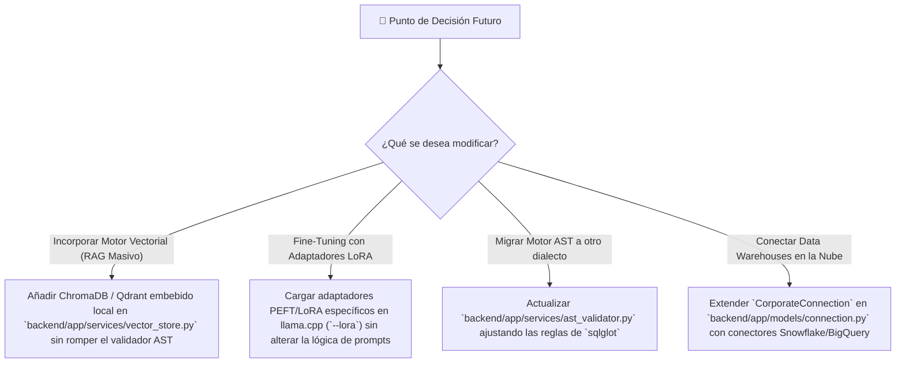

# 09 - Registro de Decisiones Arquitectónicas (ADR): Roles Corporativos, Data Profiling y Aprendizaje Autónomo

**Fecha de Creación:** Agosto 2026  
**Estado:** ✅ Aprobado & En Implementación  
**Tipo de Documento:** Architectural Decision Record (ADR) & System Checkpoint  
**Objetivo:** Documentar formalmente las elecciones técnicas tomadas, las alternativas descartadas con sus motivos, el inventario completo de archivos afectados y la guía de checkpoint para futuras evaluaciones o cambios de arquitectura.

---

## 🎯 1. Contexto y Justificación del Checkpoint

El proyecto **DATIA** (*Democratización de Datos Corporativos con IA Local*) ha alcanzado un estado de madurez donde se integran:
- Frontend 100% responsivo para cualquier dispositivo (escritorio, tabletas y teléfonos).
- Panel de Gobernanza y fuentes de base de datos corporativas con importación y eliminación física en tiempo real.
- Catálogo semántico y diccionario técnico de datos sin hardcoding.
- Detección automática multi-puerto y resiliencia para servidores de inferencia LLM locales (`llama.cpp` en puerto 8080, `Ollama` en 11434, `LM Studio` en 1234).

En esta etapa, se evalúa y redefine la arquitectura de **Roles de Usuario**, la **interpretación de esquemas corporativos complejos/numerados** y el **mecanismo de aprendizaje continuo del LLM**. Este documento establece el *checkpoint* técnico para fundamentar las decisiones y servir de punto de referencia ante cualquier reevaluación futura.

---

## 🏛️ 2. Decisiones Arquitectónicas Adoptadas (El QUÉ, POR QUÉ y PARA QUÉ)

### Decisión 1: Matriz de Roles Empresariales Funcionales vs Roles Ocupacionales Informales
- **Qué se eligió**: Reemplazar los roles simplistas ("Economista", "TI") por una matriz corporativa basada en funciones de acceso y gobierno de datos:
  1. `Director Ejecutivo / C-Level` (Visión macro, rentabilidad, riesgos, PII bloqueado).
  2. `Analista Financiero & Comercial` (Márgenes, ingresos, facturación, clientes).
  3. `Gerente de Talento & Operaciones` (Encuestas, clima, métricas operacionales y retención).
  4. `Analista de Datos & BI` (Exploración multidimensional, cruce de métricas, esquemas).
  5. `Ingeniero de Infraestructura & TI` (Logs, servidores, rendimiento de conectores, latencias).
  6. `Oficial de Cumplimiento & Seguridad (DPO)` (Auditoría AST, trazabilidad, registros rechazados).
  7. `Administrador de Plataforma` (Gestión total de conexiones, usuarios y catálogos).
  8. `Usuario Consultor` (Solo lectura de tablas públicas/demo).
- **Por Qué**: En organizaciones reales, los permisos no se otorgan por títulos personales sino por responsabilidades funcionales y niveles de confidencialidad de la información.
- **Para Qué**: Garantizar el principio de mínimo privilegio (*PoLP*), aislamiento de datos sensibles por área y escalabilidad del control de acceso basado en roles (*RBAC*).

---

### Decisión 2: Auto-Muestreo y Huella de Datos (*Data Fingerprinting*) para Tablas Criptográficas o Numeradas
- **Qué se eligió**: Implementar un motor de introspección activa que analiza muestras de datos reales (3-5 registros por columna), tipos SQL, rangos numéricos y relaciones de claves foráneas para descifrar automáticamente tablas y columnas numeradas o con códigos crípticos (ej. `tbl_101`, `col_01`, `VBAK`, `KNA1` en ERPs como SAP o AS/400).
- **Por Qué**: Los sistemas empresariales heredados (*legacy ERPs*, almacenes de datos analíticos) rara vez usan nombres descriptivos. Exigir que las tablas tengan nombres en lenguaje natural limitaría el producto a bases de datos de juguete.
- **Para Qué**: Permitir que el LLM mapee preguntas de negocio en lenguaje natural a consultas SQL precisas sobre cualquier estructura física de base de datos sin requerir renombrar tablas ni modificar el motor relacional de origen.

---

### Decisión 3: Aprendizaje Autónomo con "Cero Fricción" (*Self-Healing SQL & In-Context Memory*)
- **Qué se eligió**: Adoptar un ciclo de aprendizaje invisible e implícito compuesto por:
  - **Auto-Corrección en Tiempo Real (*Self-Healing SQL*)**: Si el LLM comete un error sintáctico o confunde una columna, el backend intercepta el error de SQLite/Postgres antes de que el usuario lo vea, solicita al LLM una corrección con el feedback del motor SQL en < 300ms y almacena la solución funcional.
  - **Memoria Episódica en Base de Datos (*Few-Shot Retrieval*)**: Las consultas exitosas se indexan en metadatos y se inyectan como ejemplos de contexto para preguntas similares del mismo rol.
  - **Señales Implícitas de Éxito**: La exportación a Excel, copiado de informe o interacción con gráficos valida los patrones de forma automática sin pedir feedback manual al usuario.
- **Por Qué**: Los directores y analistas corporativos no son entrenadores de IA ni tienen tiempo para calificar o corregir manualmente cada respuesta.
- **Para Qué**: Ofrecer una experiencia de usuario inmediata (*Out-of-the-box*), libre de fricción y con auto-mejora continua transparente.

---

### Decisión 4: Enmascaramiento Dinámico a Nivel de Columna (*Column-Level Security - CLS*)
- **Qué se eligió**: El validador AST (`sqlglot`) inspecciona y bloquea o enmascara columnas declaradas confidenciales (ej. `salario`, `email_personal`, `password_hash`) según la matriz RBAC.
- **Por Qué**: Un usuario puede estar autorizado a consultar la tabla de personal para contar trabajadores por departamento (`COUNT(*)`), pero no debe ver las remuneraciones individuales ni datos privados.
- **Para Qué**: Evitar fugas de datos (*Data Leakage*) y cumplir normativas de privacidad (GDPR / ISO 27001).

---

## 🚫 3. Opciones Evaluadas y Descartadas (Con Justificación Técnica)

| Opción Descartada | Descripción de la Alternativa | Motivo de Descarte (Por qué NO) |
| :--- | :--- | :--- |
| **❌ Personalidad y Prompts Hardcodeados por Rol** | Escribir cadenas estáticas de texto para cada rol (ej. *"Tú eres un economista y hablas formal"*). | **Rigidez extrema:** Convierte al LLM en un motor de plantillas estáticas, anula la adaptabilidad semántica y no resuelve el aprendizaje ante nuevos datos o tablas crípticas. |
| **❌ Fine-Tuning Local Continuo por Consulta** | Reentrenar o ajustar los pesos del LLM localmente con cada nueva pregunta realizada. | **Inviable técnicamente:** Requiere cómputo masivo (minutos/horas por query), GPU dedicada de alta gama, provoca *olvido catastrófico* (*catastrophic forgetting*) e introduce inestabilidad en las inferencias. |
| **❌ Entrenamiento Manual por el Usuario (Feedback Obligatorio)** | Forzar al usuario a calificar con estrellas o corregir el SQL generado antes de continuar. | **Fricción inadmisible:** En entornos corporativos, los usuarios abandonan cualquier herramienta que demande trabajo adicional de configuración o enseñanza manual. |
| **❌ Dependencia de Nombres Legibles en la BD** | Exigir que todas las tablas y columnas se llamen con palabras legibles como `fact_ventas_2024` o `nombre_cliente`. | **Incompatibilidad empresarial:** La mayoría de las bases de datos de producción corporativas utilizan nomenclaturas abreviadas o numéricas (`tbl_01`, `KNA1`). |
| **❌ Almacenamiento en Memoria Volátil (localStorage)** | Guardar reglas semánticas y conexiones en el navegador del cliente. | **Falta de persistencia y gobierno:** Limita los datos a una sola máquina/navegador, no permite auditoría centralizada y se borra al limpiar caché. |

---

## 📂 4. Inventario Exhaustivo de Archivos Creados, Editados y Eliminados

A continuación se detalla la función de cada archivo modificado en la plataforma durante esta evolución:

### ⚙️ Backend (Python FastAPI + SQLite + SQLAlchemy + AST Validator)

| Archivo | Estado | Responsabilidad & Funcionamiento |
| :--- | :--- | :--- |
| [`backend/app/services/health_service.py`](file:///c:/Users/Felipe/Desktop/Proyectos/democratizacion%20de%20datos/backend/app/services/health_service.py) | **EDITADO** | Sondeo inteligente multi-puerto (8080 `llama.cpp`, 11434 `Ollama`, 1234 `LM Studio`) y verificación de integridad física de archivos SQLite sin falsos positivos. |
| [`backend/app/api/v1/endpoints/system.py`](file:///c:/Users/Felipe/Desktop/Proyectos/democratizacion%20de%20datos/backend/app/api/v1/endpoints/system.py) | **EDITADO** | Endpoint `/health` con parámetros opcionales dinámicos (`provider`, `base_url`, `model_name`) para reflejar en vivo el estado y modelo activo. |
| [`backend/app/services/llm_service.py`](file:///c:/Users/Felipe/Desktop/Proyectos/democratizacion%20de%20datos/backend/app/services/llm_service.py) | **EDITADO** | Cliente agnóstico multicanal con limpieza de tags `<think>`, timeouts para modelos pesados y resolución de endpoints nativos y OpenAI-compatible. |
| [`backend/app/services/query_engine.py`](file:///c:/Users/Felipe/Desktop/Proyectos/democratizacion%20de%20datos/backend/app/services/query_engine.py) | **EDITADO** | Motor central de Text-to-SQL, validación anticipada de SQL directo, enrutamiento a BD activa, generación de KPIs, gráficos dinámicos y reportes ejecutivos. |
| [`backend/app/services/ast_validator.py`](file:///c:/Users/Felipe/Desktop/Proyectos/democratizacion%20de%20datos/backend/app/services/ast_validator.py) | **EDITADO** | Validador de árboles de sintaxis abstracta (*AST*) con `sqlglot`. Garantiza solo `SELECT`, mono-sentencia, tablas autorizadas y límite de filas. |
| [`backend/app/services/dynamic_schema.py`](file:///c:/Users/Felipe/Desktop/Proyectos/democratizacion%20de%20datos/backend/app/services/dynamic_schema.py) | **EDITADO** | Podado dinámico de esquemas; construye prompts optimizados conteniendo únicamente las tablas y columnas autorizadas para el rol. |
| [`backend/app/api/v1/endpoints/connectors.py`](file:///c:/Users/Felipe/Desktop/Proyectos/democratizacion%20de%20datos/backend/app/api/v1/endpoints/connectors.py) | **EDITADO** | Subida de SQLite/SQL (`POST /upload`), conmutación de BD activa (`POST /toggle-active`) y borrado físico en cascada (`DELETE /{id}`). |
| [`backend/app/api/v1/endpoints/catalog.py`](file:///c:/Users/Felipe/Desktop/Proyectos/democratizacion%20de%20datos/backend/app/api/v1/endpoints/catalog.py) | **EDITADO** | CRUD de catálogo semántico (`/catalog/`), introspección física del esquema (`/catalog/data-dictionary`) y auto-enriquecimiento heurístico/IA. |
| [`backend/app/api/v1/endpoints/chat.py`](file:///c:/Users/Felipe/Desktop/Proyectos/democratizacion%20de%20datos/backend/app/api/v1/endpoints/chat.py) | **EDITADO** | Endpoint `/chat/query` con derivación estricta de rol desde JWT y registro persistente de auditoría en la tabla `audit_logs`. |
| [`backend/app/db/init_db.py`](file:///c:/Users/Felipe/Desktop/Proyectos/democratizacion%20de%20datos/backend/app/db/init_db.py) | **EDITADO** | Migración en caliente de columna `is_uploaded` y poblado inicial idempotente de roles, usuarios demo y permisos de tablas. |
| [`backend/app/models/connection.py`](file:///c:/Users/Felipe/Desktop/Proyectos/democratizacion%20de%20datos/backend/app/models/connection.py) | **EDITADO** | Modelo SQLAlchemy `CorporateConnection` con campo `is_uploaded: bool`. |
| [`backend/app/schemas/connection_schema.py`](file:///c:/Users/Felipe/Desktop/Proyectos/democratizacion%20de%20datos/backend/app/schemas/connection_schema.py) | **EDITADO** | Esquemas Pydantic para creación, actualización y salida de conexiones. |
| [`backend/app/schemas/catalog_schema.py`](file:///c:/Users/Felipe/Desktop/Proyectos/democratizacion%20de%20datos/backend/app/schemas/catalog_schema.py) | **EDITADO** | Esquemas para catálogo semántico, diccionario de datos técnico y auto-enriquecimiento. |
| [`backend/tests/test_catalog_and_connectors.py`](file:///c:/Users/Felipe/Desktop/Proyectos/democratizacion%20de%20datos/backend/tests/test_catalog_and_connectors.py) | **NUEVO** | Suite de pruebas unitarias para ciclo de vida de catálogo, introspección de diccionario y subida/borrado de SQLite. |
| [`backend/tests/test_system_health.py`](file:///c:/Users/Felipe/Desktop/Proyectos/democratizacion%20de%20datos/backend/tests/test_system_health.py) | **EDITADO** | Suite de pruebas de monitoreo de salud del sistema, LLM y conectores. |
| [`backend/tests/test_audit_log.py`](file:///c:/Users/Felipe/Desktop/Proyectos/democratizacion%20de%20datos/backend/tests/test_audit_log.py) | **EDITADO** | Verificación de persistencia de consultas aprobadas y rechazadas por RBAC/AST. |
| [`backend/tests/test_chat_security.py`](file:///c:/Users/Felipe/Desktop/Proyectos/democratizacion%20de%20datos/backend/tests/test_chat_security.py) | **EDITADO** | Validación de seguridad contra suplantación de rol en el cuerpo del request y cumplimiento de JWT. |

---

### 🎨 Frontend (React + TypeScript + TailwindCSS + Vite)

| Archivo | Estado | Responsabilidad & Funcionamiento |
| :--- | :--- | :--- |
| [`src/hooks/useSystemHealth.ts`](file:///c:/Users/Felipe/Desktop/Proyectos/democratizacion%20de%20datos/src/hooks/useSystemHealth.ts) | **EDITADO** | Hook de polling de salud con sincronización de opciones (`ollama_url`, `llm_provider`, `ollama_model`) y control de alertas. |
| [`src/components/layout/Header.tsx`](file:///c:/Users/Felipe/Desktop/Proyectos/democratizacion%20de%20datos/src/components/layout/Header.tsx) | **EDITADO** | Encabezado responsivo con menú móvil desplegable, popover de salud del sistema y badge dinámico de IA Local activa (`llama.cpp` / `Ollama`). |
| [`src/components/chat/SidebarChatHistory.tsx`](file:///c:/Users/Felipe/Desktop/Proyectos/democratizacion%20de%20datos/src/components/chat/SidebarChatHistory.tsx) | **EDITADO** | Historial de conversaciones con modo drawer en móviles, backdrop oscuro e indicador de base de datos activa. |
| [`src/pages/ChatDashboardPage.tsx`](file:///c:/Users/Felipe/Desktop/Proyectos/democratizacion%20de%20datos/src/pages/ChatDashboardPage.tsx) | **EDITADO** | Vista principal de chat analítico responsivo, sugerencias adaptables y visualización de resultados. |
| [`src/components/dashboard/ExecutiveDashboardView.tsx`](file:///c:/Users/Felipe/Desktop/Proyectos/democratizacion%20de%20datos/src/components/dashboard/ExecutiveDashboardView.tsx) | **EDITADO** | Vista ejecutiva multimodelo; distingue claramente bloqueos de seguridad AST/RBAC de estados offline del LLM o resultados vacíos. |
| [`src/components/dashboard/ExecutiveStudioView.tsx`](file:///c:/Users/Felipe/Desktop/Proyectos/democratizacion%20de%20datos/src/components/dashboard/ExecutiveStudioView.tsx) | **EDITADO** | Estudio visual con selectores de tipo de gráfico, temas de color y exportación responsiva. |
| [`src/components/datagrid/DataGridTable.tsx`](file:///c:/Users/Felipe/Desktop/Proyectos/democratizacion%20de%20datos/src/components/datagrid/DataGridTable.tsx) | **EDITADO** | Tabla de datos con scroll horizontal suave, paginación y exportación a Excel/CSV. |
| [`src/components/traceability/TraceabilityModal.tsx`](file:///c:/Users/Felipe/Desktop/Proyectos/democratizacion%20de%20datos/src/components/traceability/TraceabilityModal.tsx) | **EDITADO** | Modal de auditoría SQL y AST responsivo con scroll interno y formateo de consultas. |
| [`src/components/admin/AdminConnectorsTab.tsx`](file:///c:/Users/Felipe/Desktop/Proyectos/democratizacion%20de%20datos/src/components/admin/AdminConnectorsTab.tsx) | **EDITADO** | Pestaña de conectores con soporte para importar bases de datos, conmutación activa y eliminación real. |
| [`src/components/admin/AdminCatalogTab.tsx`](file:///c:/Users/Felipe/Desktop/Proyectos/democratizacion%20de%20datos/src/components/admin/AdminCatalogTab.tsx) | **EDITADO** | Pestaña con selector de sub-pestañas: **Catálogo Semántico** y **Diccionario de Datos** técnico con muestras en vivo. |
| [`src/components/admin/DatabaseUploadModal.tsx`](file:///c:/Users/Felipe/Desktop/Proyectos/democratizacion%20de%20datos/src/components/admin/DatabaseUploadModal.tsx) | **NUEVO** | Modal interactivo *Drag & Drop* para archivos `.sqlite`, `.db`, `.sqlite3` y `.sql`. |
| [`src/components/admin/CatalogEditModal.tsx`](file:///c:/Users/Felipe/Desktop/Proyectos/democratizacion%20de%20datos/src/components/admin/CatalogEditModal.tsx) | **NUEVO** | Modal para editar descripciones y fórmulas de negocio en el catálogo semántico. |
| [`src/components/admin/CatalogAddModal.tsx`](file:///c:/Users/Felipe/Desktop/Proyectos/democratizacion%20de%20datos/src/components/admin/CatalogAddModal.tsx) | **NUEVO** | Modal para registrar nuevas columnas y entidades semánticas manualmente. |
| [`src/services/catalog_service.ts`](file:///c:/Users/Felipe/Desktop/Proyectos/democratizacion%20de%20datos/src/services/catalog_service.ts) | **NUEVO** | Cliente API para interactuar con los endpoints de catálogo y diccionario de datos. |
| [`src/services/connector_service.ts`](file:///c:/Users/Felipe/Desktop/Proyectos/democratizacion%20de%20datos/src/services/connector_service.ts) | **EDITADO** | Cliente API para importación, listado, conmutación y eliminación de fuentes de datos. |
| [`src/services/llm_service.ts`](file:///c:/Users/Felipe/Desktop/Proyectos/democratizacion%20de%20datos/src/services/llm_service.ts) | **EDITADO** | Cliente de prueba de conectividad e inferencia con auto-detección y fallback de puertos. |

---

## 🗺️ 5. Guía de Checkpoint para Evaluaciones Futuras

Si en el futuro se desea evolucionar o replantear algún aspecto arquitectónico, este es el mapa de decisiones y componentes clave a intervenir:

1. **Si se desea añadir nuevos roles**: Registrar las constantes en `backend/app/core/constants.py` y crear el registro correspondiente en la tabla `roles` de la base de datos de metadatos.
2. **Si se desea ajustar el muestreo de datos para tablas numéricas**: Modificar la función de introspección en `backend/app/api/v1/endpoints/catalog.py` (`get_data_dictionary`).
3. **Si se desea cambiar el comportamiento del Self-Healing SQL**: Intervenir la sección `BRANCH B` en `backend/app/services/query_engine.py`.

---

*Fin del Documento de Registro Arquitectónico (ADR).*
